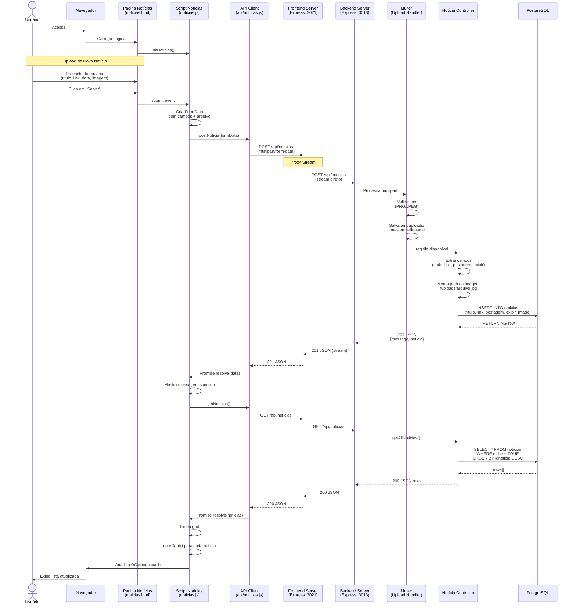
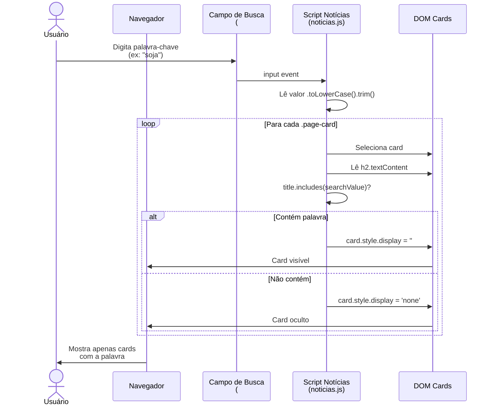
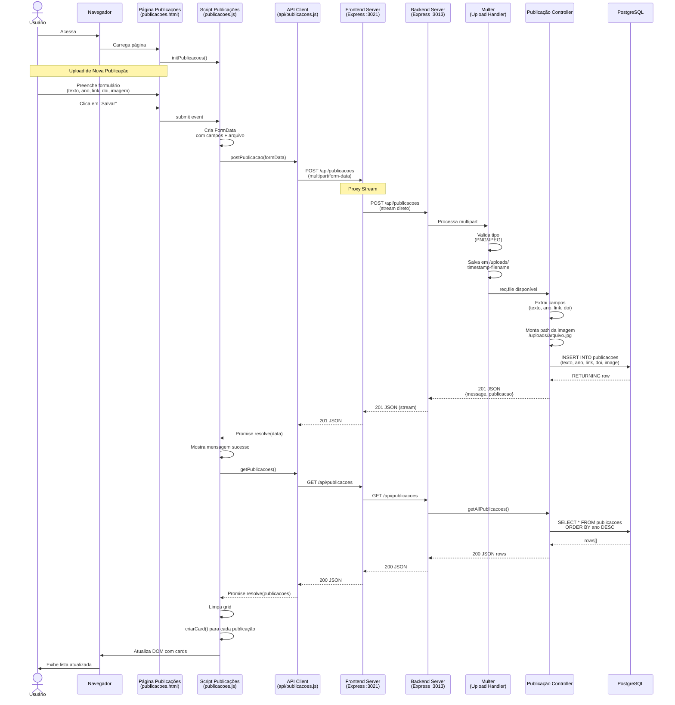
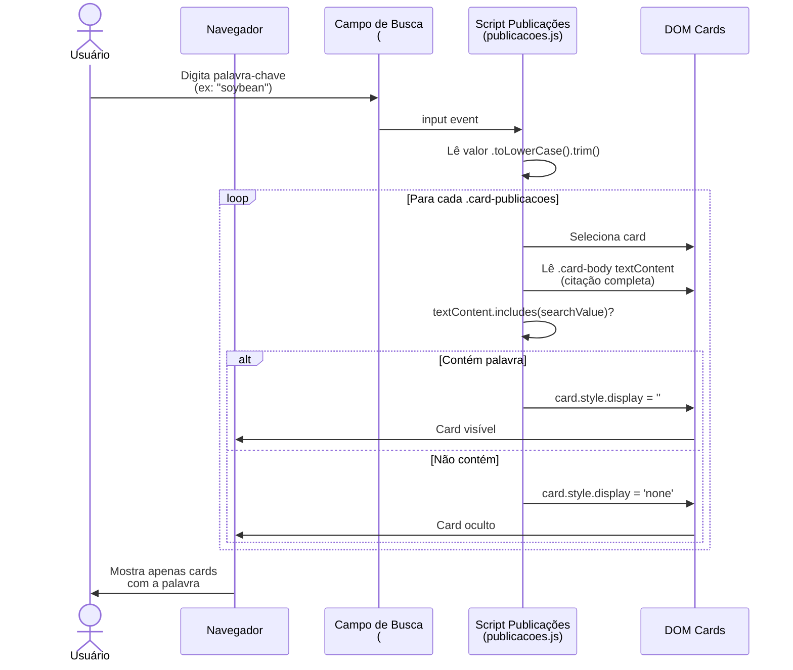
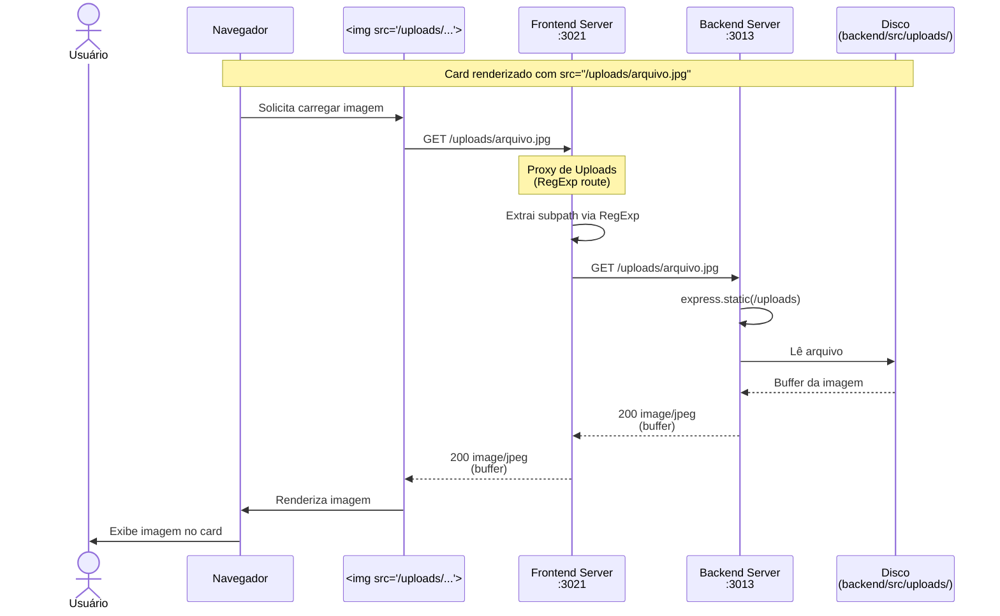
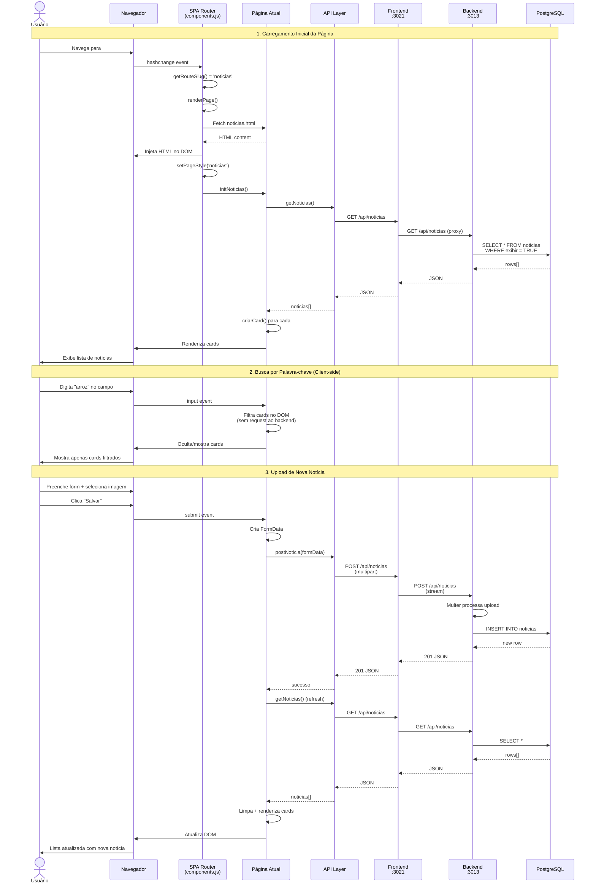

# Diagramas UML de Sequência - Sistema AgriRSLab

## 1. Upload de Notícia com Imagem

## 2. Busca de Notícias por Palavra-chave

## 3. Upload de Publicação com Imagem

## 4. Busca de Publicações por Palavra-chave (Texto Completo)

## 5. Carregamento de Imagem (Upload via Backend)

## 6. Fluxo Completo: Página Carrega → Busca → Upload

## Notas Técnicas

### Componentes do Sistema

1. **Frontend Server (Express :3021)**
   - Serve arquivos estáticos (HTML, CSS, JS, imagens locais)
   - Proxy para APIs do backend (evita CORS)
   - Proxy para uploads do backend (/uploads/*)

2. **Backend Server (Express :3013)**
   - API REST (/api/noticias, /api/publicacoes, /api/oportunidades)
   - Multer para upload de imagens
   - Serve arquivos de /uploads estaticamente
   - Conecta ao PostgreSQL

3. **PostgreSQL**
   - Tabelas: noticias, publicacoes, oportunidades
   - Campos image/imagem: VARCHAR com path relativo

### Fluxos de Dados

- **Upload**: Browser → Frontend Proxy → Backend Multer → Filesystem + DB
- **GET**: Browser → Frontend Proxy → Backend → PostgreSQL → JSON
- **Busca**: Client-side (filtra DOM sem request ao backend)
- **Imagens**: Browser → Frontend Proxy → Backend Static → Filesystem

### Segurança e Validação

- Multer valida tipo MIME (PNG/JPEG apenas)
- Backend valida campos obrigatórios
- Frontend mostra feedback de erro/sucesso
- Proxy preserva headers e status codes
